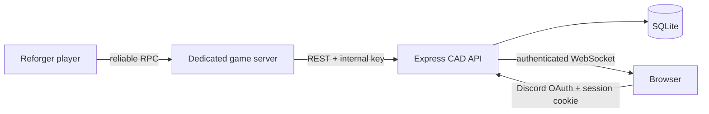

# Shadow RP CAD / MDT

A complete starter system for a Shadow RP Arma Reforger server:

- React/Vite CAD and civilian portal
- Node.js/Express bridge with SQLite, Discord OAuth, REST, and WebSockets
- Arma Reforger addon using Enfusion's current public `RestApi` / `RestContext` API

The repository is intentionally framework-light. SQLite is accessed through Node's built-in `node:sqlite` module; there is no native database package or Prisma generation step.

## Project layout

```text
shadow-rp-cad/
├── backend/
│   ├── src/
│   │   ├── app.js             Express middleware and app factory
│   │   ├── auth.js            Discord OAuth, sessions, RBAC, internal auth
│   │   ├── config.js          Environment configuration
│   │   ├── db.js              Schema and development seed
│   │   ├── routes.js          REST API
│   │   ├── server.js          HTTP and WebSocket server
│   │   ├── sessionStore.js    Persistent SQLite session store
│   │   └── ws.js              Authenticated real-time hub
│   ├── test/api.test.js
│   └── Dockerfile
├── frontend/
│   ├── src/components/        Navigation and shared UI
│   ├── src/pages/             Dashboard, lookup, map, reports, linking, personas
│   └── vite.config.js
├── reforger-addon/
│   ├── addon.gproj
│   └── Scripts/Game/ShadowRP/CAD/
│       ├── SRP_CADNetworkManager.c
│       ├── SRP_AccountLinkComponent.c
│       ├── SRP_DutySyncComponent.c
│       └── SRP_EmergencyCallAction.c
└── .github/workflows/deploy-pages.yml
```

## Architecture and trust boundaries



Only the dedicated game server knows `INTERNAL_API_KEY`. Browser endpoints use a Discord-backed session and role checks. Never put the internal key in `frontend/.env`: Vite variables are public.

## 1. Local setup

Requirements: Node.js 22.5 or newer (22 LTS recommended), npm, and Arma Reforger Tools for addon work.

```bash
cp .env.example .env
npm install
npm run dev
```

On Windows PowerShell, use `Copy-Item .env.example .env` instead of `cp`.

Open `http://localhost:5173`. With `DEV_AUTH=true`, the login screen shows a development login. The development database is seeded with an admin, one persona, one vehicle, one active call, and one unit. Set `DEV_AUTH=false` outside local development.

Useful commands:

```bash
npm test
npm run build
npm run dev
```

The API runs on port 3001 and the UI on port 5173. SQLite is created at `backend/data/shadow-rp.sqlite` when starting from the repository root through npm workspaces.

## 2. Discord OAuth

1. In the Discord Developer Portal, create an application.
2. Under OAuth2, add the redirect URL `http://localhost:3001/auth/discord/callback`.
3. Put the client ID and client secret in `.env`.
4. For production, add the production API callback, for example `https://cad-api.example.com/auth/discord/callback`.
5. Set `DISCORD_CALLBACK_URL`, `PUBLIC_API_URL`, and `FRONTEND_URL` to their public HTTPS URLs.

New Discord users receive the `CIVILIAN` role. Promote staff in SQLite after vetting them:

```sql
UPDATE users SET role = 'LEO' WHERE discord_id = '123456789012345678';
```

Allowed roles are `CIVILIAN`, `LEO`, `EMS`, `DISPATCH`, and `ADMIN`. A production server can replace this manual promotion with a Discord guild-role mapping without changing the database model.

## 3. Account linking flow

1. The player uses `SRP_AccountLinkAction` on an in-game linking terminal.
2. The player-owned component sends a reliable RPC to the server authority.
3. The server derives the player's Bohemia identity ID and posts to `/api/link/generate`.
4. The API stores a random six-character, single-use token for 10 minutes.
5. The server sends the code only to that entity's owner and shows a hint.
6. The player signs in to the CAD and enters the code on **Account link**.
7. `/api/link/verify` binds the Reforger UID to the authenticated Discord user and consumes the token atomically.

Steam ID64 is optional because cross-platform Reforger players may not have a Steam identity. The Bohemia identity is the authoritative in-game link.

## 4. REST API

All browser requests use the session cookie. The three in-game POST routes require either an `X-API-Key` header or an `apiKey` field in the JSON body. The Enfusion implementation uses the body because header support has varied across engine releases.

| Method | Path | Access | Purpose |
|---|---|---|---|
| GET | `/api/health` | Public | Health check |
| GET | `/api/me` | Signed in | Current user |
| POST | `/api/link/generate` | Internal key | Generate six-character token |
| POST | `/api/link/verify` | Signed in | Consume token and link identity |
| POST | `/api/cad/call911` | Internal key | Ingest emergency call |
| POST | `/api/cad/unit-status` | Internal key | Upsert unit, duty state, and position |
| GET | `/api/cad/dashboard` | CAD role | Active calls and recent units |
| PATCH | `/api/cad/calls/:id` | CAD role | Assign units or change call status |
| GET | `/api/cad/civilian/lookup?name=` | CAD role | Name lookup |
| GET | `/api/cad/vehicle/lookup?plate=` | CAD role | Plate lookup |
| GET/POST | `/api/characters` | Signed in | List/create own personas |
| GET/POST | `/api/vehicles` | Signed in | List/register own vehicles |
| POST | `/api/reports` | CAD role | File incident, arrest, or citation report |
| WS | `/ws` | Signed in | `call.created`, `call.updated`, `unit.updated` events |

Example game-server request:

```bash
curl -X POST http://localhost:3001/api/link/generate \
  -H "Content-Type: application/json" \
  -H "X-API-Key: development-internal-key" \
  -d '{"reforgerUid":"bi-identity-id","playerName":"Jane Player"}'
```

## 5. Database schema

The schema is created idempotently on startup in `backend/src/db.js`.

- `users`: Discord identity, optional Steam ID64, Reforger UID, staff role
- `characters`: civilian personas, license states, warrants, priors
- `vehicles`: plate, model, color, owner, stolen flag
- `active_calls`: caller, grid and world coordinates, status, assigned units
- `units`: identity, callsign, agency, rank, duty status, live coordinates
- `link_tokens`: expiring single-use code and Reforger identity
- `reports`: incident, arrest, and citation reports
- `sessions`: server-side authenticated sessions

Warrants, priors, charges, and assigned units are stored as JSON text to keep this starter easy to deploy. For a high-volume community, normalize those fields and migrate to PostgreSQL.

## 6. Reforger Workbench setup

The scripts target the current public API shape documented by Bohemia for Reforger 1.7-era documentation:

- `GetGame().GetRestApi().GetContext(baseUrl)` returns `RestContext`.
- `RestContext.POST(callback, requestPath, data)` is asynchronous.
- Current callbacks are configured with `RestCallback.SetOnSuccess` and `SetOnError`; the older virtual `OnSuccess` / `OnError` / `OnTimeout` pattern is marked obsolete.
- A callback must remain referenced until the response arrives. `SRP_CADNetworkManager` therefore retains active callbacks in an array.
- `SCR_PlayerIdentityUtils.GetPlayerIdentityId(IEntity)` supplies the Bohemia identity.
- `SCR_MapEntity.GetGridLabel(vector)` supplies the map grid.

Workbench steps:

1. Copy `reforger-addon` into your Reforger Workbench addon directory. If Workbench regenerates `addon.gproj`, keep the `Scripts` directory and select **ArmaReforger** as the dependency.
2. Open `addon.gproj` in Arma Reforger Tools. Let Workbench build the resource database.
3. In your game-mode prefab, add `SRP_CADNetworkManager` to the replicated game-mode entity. Set `Api Base Url` to the public HTTPS API origin with no trailing slash and set the internal key.
4. Ensure the game-mode entity has an `RplComponent`. Bohemia requires replicated entities for RPC delivery.
5. Add `SRP_AccountLinkComponent` and `SRP_DutySyncComponent` to the replicated player-character prefab.
6. Add an `ActionsManagerComponent` and valid action context to a kiosk/payphone prefab. Add `SRP_AccountLinkAction` to the linking kiosk and `SRP_EmergencyCallAction` to the payphone/radio object. Give each action a `UIInfo` label in Workbench.
7. Locker or radial menu code should call the local player's duty component, for example:

```c
SRP_DutySyncComponent duty = SRP_DutySyncComponent.Cast(player.FindComponent(SRP_DutySyncComponent));
duty.SetDutyStatus("10-8", "1-L-12", "LEO", "Deputy");
```

Use `10-7`, `10-6`, or `10-99` for busy/off duty, arrived, or panic. For periodic location tracking, call `SetDutyStatus` on a conservative timer such as 10–20 seconds; do not send per-frame HTTP requests.

8. Run a dedicated-server preview. The API must be reachable from the server machine. `localhost` means the game server itself, not your development PC.
9. Check the server console for `[ShadowRP CAD]` messages and test linking, status updates, and a payphone call.

The REST API is deliberately executed only by the server authority. Do not place the internal key in a client-only UI script. Treat compiled/published addon content as inspectable and restrict the API key to narrow in-game endpoints, as this backend does.

## 7. Frontend deployment

### Vercel

1. Import the repository.
2. Set the root directory to `frontend`.
3. Build command: `npm run build`.
4. Output directory: `dist`.
5. Add `VITE_API_URL=https://your-api.example.com`.
6. Deploy, then set backend `FRONTEND_URL` to the exact Vercel URL and update the Discord redirect URL.

The app uses hash routing, so it does not require rewrite rules.

### GitHub Pages

1. Push the repository to GitHub and enable **Settings → Pages → GitHub Actions**.
2. Add a repository Actions variable named `VITE_API_URL` containing the HTTPS API origin.
3. Push to `main` or manually run **Deploy frontend to GitHub Pages**.

The included workflow automatically supplies the repository subpath to Vite.

## 8. Backend deployment

The backend cannot run on GitHub Pages. Deploy it to a service that supports a persistent Node process, WebSockets, and persistent disk (a small VPS, Railway, Render, Fly.io, or similar).

Container example:

```bash
docker build -t shadow-rp-cad-api ./backend
docker run -p 3001:3001 -v shadow-cad-data:/app/data --env-file .env shadow-rp-cad-api
```

Set all production variables from `.env.example`, use long random secrets, set `NODE_ENV=production`, and attach persistent storage at `/app/data`. Put the service behind HTTPS. Without a persistent volume, SQLite data will disappear when an ephemeral container is replaced.

For separate frontend and API domains, the backend sets a `Secure; SameSite=None` session cookie in production. `FRONTEND_URL` must match the browser origin exactly for credentialed CORS.

## Production checklist

- Rotate `SESSION_SECRET` and `INTERNAL_API_KEY`; never commit `.env`.
- Disable `DEV_AUTH` and confirm it is not available in production.
- Use HTTPS for both the CAD and API.
- Back up the SQLite database and persistent volume.
- Vet and assign staff roles; civilian accounts cannot reach CAD records.
- Restrict the API at a reverse proxy/firewall where practical.
- Review privacy/retention rules for Discord IDs, platform IDs, reports, and locations.
- Load-test before a major event; migrate to PostgreSQL and a shared session store for multiple API replicas.

## Primary Enfusion references

- [Bohemia: REST API Usage](https://community.bistudio.com/wiki/Arma_Reforger:REST_API_Usage)
- [Bohemia: RestContext API](https://community.bistudio.com/wikidata/external-data/arma-reforger/EnfusionScriptAPIPublic/interfaceRestContext.html)
- [Bohemia: RestCallback API](https://community.bistudio.com/wikidata/external-data/arma-reforger/EnfusionScriptAPIPublic/interfaceRestCallback.html)
- [Bohemia: Multiplayer Scripting and RPCs](https://community.bistudio.com/wiki/Arma_Reforger:Multiplayer_Scripting)
- [Bohemia: JsonApiStruct Usage](https://community.bistudio.com/wiki/Arma_Reforger:JsonApiStruct_Usage)
- [Bohemia: Player identity helper](https://community.bistudio.com/wikidata/external-data/arma-reforger/ArmaReforgerScriptAPIPublic/interfaceSCR__PlayerIdentityUtils.html)
- [Bohemia: map grid helpers](https://community.bistudio.com/wikidata/external-data/arma-reforger/ArmaReforgerScriptAPIPublic/interfaceSCR__MapEntity.html)
- [Bohemia: ScriptedUserAction](https://community.bistudio.com/wikidata/external-data/arma-reforger/ArmaReforgerScriptAPIPublic/interfaceScriptedUserAction.html)

## Scope notes

This is production-minded starter code, not a claim of turnkey compatibility with every customized Shadow RP prefab. Reforger prefab wiring, UIInfo resources, action contexts, and scenario ownership are authored in Workbench and cannot be represented fully by `.c` files alone. Compile the addon against the exact Reforger Tools build used by your server and resolve any engine-version migration warnings before publishing.
